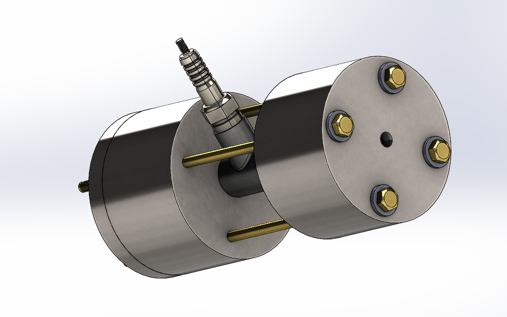

# Experimental Rocket Engine CAD & CFD Simulation

## About the Project

This project focuses on the structural design and fluid-dynamic validation of a rocket engine. The CAD assembly features a dual-inlet impinging injector, a spark-ignited tubular combustion chamber, and a converging-diverging nozzle, all mechanically clamped by heavy-duty threaded tie-rods for stability under high internal pressures. 

This repository contains the complete 3D models and the results of Computational Fluid Dynamics (CFD) simulations conducted to validate the theoretical internal flow properties of the engine.

## Key Features

* **Complete 3D CAD Assembly:** Includes detailed part models for the injector plate, tubular combustion chamber, nozzle block, ignition port, and fastening hardware.
* **Impinging Injector Design:** Features a dual-inlet system designed to facilitate optimal fluid mixing prior to combustion.
* **Structural Hardware:** Utilizes heavy-duty threaded tie-rods to securely clamp the assembly and withstand simulated internal chamber pressures.
* **Comprehensive CFD Analysis:** Extensive flow trajectory simulations using internal flow analysis tools to validate theoretical performance.

## Simulation Highlights

The simulations within this project focus on the fluid dynamics from the injector inlets through the nozzle exit:

### Velocity Flow Trajectories
Visualizes the fluid velocity vectors from the dual injector inlets, demonstrating the complex swirling and mixing patterns within the combustion chamber.

### Internal Chamber Dynamics
Section views illustrate the pressure and velocity gradients directly inside the injector plate and the nozzle convergence zone.

### Mach Number Validation
Cross-sectional compressible flow analysis confirms the theoretical acceleration of the fluid. The models demonstrate the flow transitioning from subsonic velocities in the chamber, choking at the throat, and successfully expanding to supersonic speeds (Mach > 1) in the diverging section of the nozzle.

## References & Inspiration

The mathematical modeling and design principles applied in this project are heavily inspired by the methodologies outlined in the [How to Rocket](https://spacha.github.io/How-to-Rocket/) guide by Spacha. 

## Disclaimer

**Educational Purposes Only:** This repository and its contents are strictly for educational, theoretical, and simulation purposes. The CAD files and simulation data provided here are meant to explore fluid dynamics and mechanical design principles in a virtual environment. They do not constitute safe or complete instructions for the physical manufacturing, fabrication, or testing of functional rocket motors or hazardous propulsion systems. Always prioritize safety and adhere to local regulations regarding amateur rocketry.
